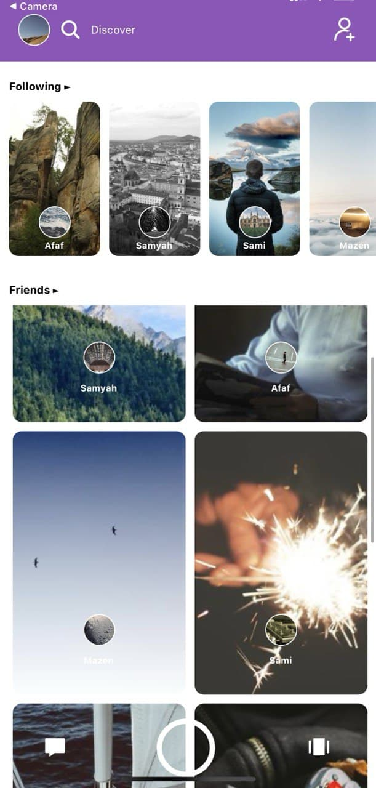

# lab-week14_day04_frontend_reactNative :smile:


Create Snap Chat stories page


## Technologies :

- React native
- JS 
- CSS

<br>

##


### Get Started:

```terminal
  $ git clone https://github.com/SamirahAlhusayni/lab-week14_day04_frontend_reactNative.git

  $ cd lab-week14_day04_frontend_reactNative/w14-d4
  $ npm install
  $ npm start
```


### Snap Chat stories page:




<br/>

## By:

 Samirah Alhusayni
 ➝ [@SamirahAlhusayni](https://github.com/SamirahAlhusayni)

